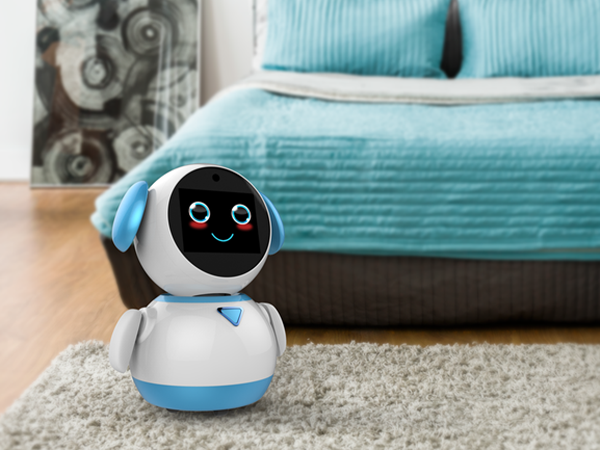
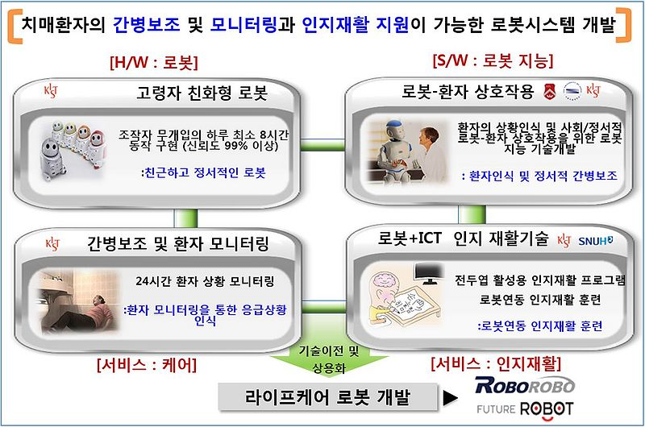
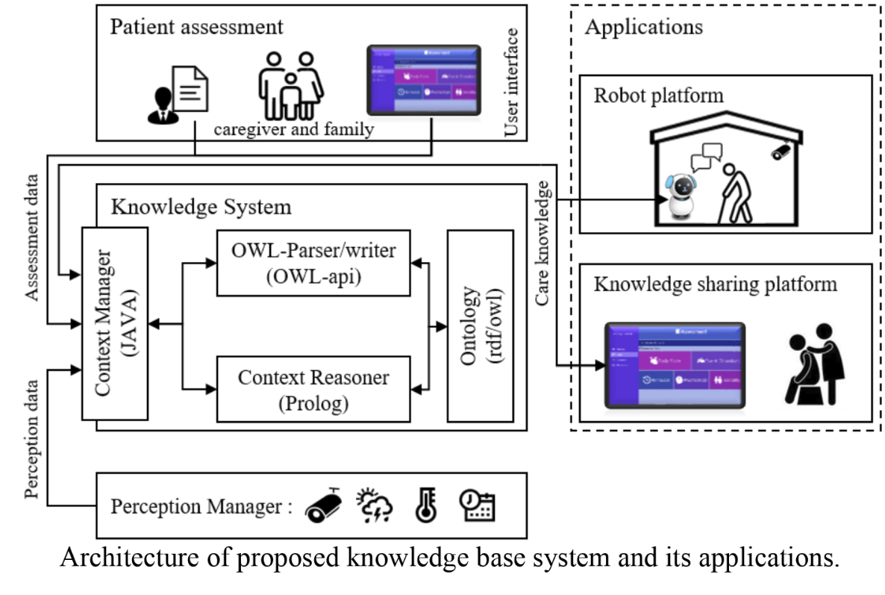

 
 

[KIST - Official Web site (ENG)](http://dtc.kist.re.kr/eng/researcher/list.php?dcode=R04)
[KIST -Official Web site (KOR)](http://dtc.kist.re.kr/kor/researcher/list.php?dcode=R04)

[MyBom Research Team Web site (KOR)](http://www.robot-intelligence.kr/index.php/Main_Page)

[Korea Institute of Science and Technology](https://www.kist.re.kr), [sHRI-Lab](https://shri-lab-kist.github.io)

## 1. About  - Diagnosis, Treatment and Care System of Dementia(DTC)

* DTC care robot 프로젝트는 치매환자의 간병 보조 및 모니터링과 인지 재활 지원 기능을 토대로 환자에게 라이프 케어 서비스를 제공 하는 프로젝트입니다. 고령자 친화형 로봇과 로봇-환자 간 상호작용을 위한 로봇 지식, 간병 보조 및 환자 모니터링, 로봇+ICT를 이용한 인지 제활 기술을 제시합니다.
* (ENG)

## 2. Context Reasoning

* (KOR)
* we propose a knowledge base system that is designed to adaptively provide guidelines for caring person with dementia (PwD) with different dementia symptoms, thereby contributing improved care conditions to caregivers and family members at either care facility or home. Proposed system contains diverse knowledge for caring PwD based on general dementia care knowledge and behavioral and psychophysical assessment manual used in dementia care facility in Korea. Also, knowledge on the home environment, social relations and various patient’s situations that can happen during daily life are included.

## 3. Knowledge Management

## 4. Demonstration Video
### Demo Video of DTC Project #1
<html>
<head></head>
<body>
<iframe width="640" height="360" src="https://www.youtube.com/embed/HpHzefgP3rs"" frameborder="0" allow="autoplay; encrypted-media" allowfullscreen></iframe>
</body>
</html>
 

### Demo Video of DTC Project #2
<html>
<head></head>
<body>
<iframe width="640" height="360" src="https://www.youtube.com/embed/fd4qrVeuXf8" frameborder="0" allow="autoplay; encrypted-media" allowfullscreen></iframe>
</body>
</html>
 

## 5. Reference Repository(Private)
If you are interested in these sources, Please send mail to the following address.
- Context Reasoner, [Github-Repository](https://github.com/HW-Jeon/Context-Reasoner-full.git)
- Knowledge Management, [Github-Repository](https://github.com/deep-task/KIST_Integration.git)

### Contact
[J.S. Choi](https://shri-lab-kist.github.io/people/jongsuk) : [e-mail ](cjs@kist.re.kr)
[Y.S. Lim](https://shri-lab-kist.github.io/people/yoonseob) : [e-mail](yslim@kist.re.kr)
[H.W. Jeon](https://shri-lab-kist.github.io/people/hwawoo) : [e-mail](feelgood88@kist.re.kr)
[H.U. Bhin](https://shri-lab-kist.github.io/people/hyeonuk) : [e-mail](bhu@kist.re.kr)
 

---
