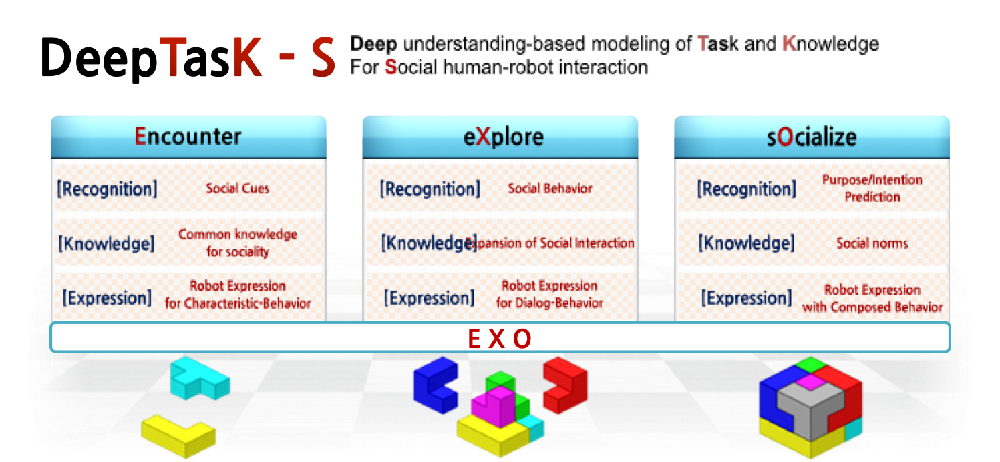
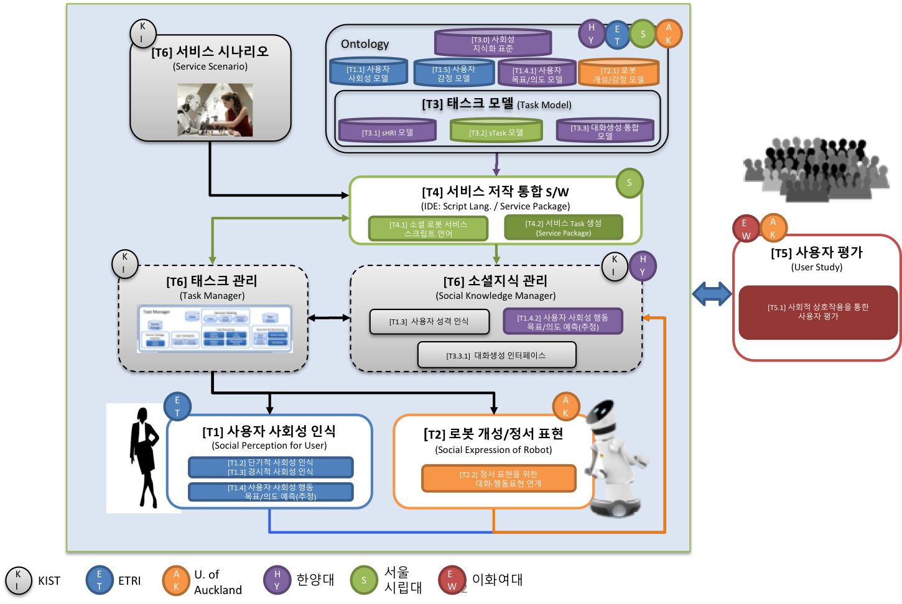

# About DeepTask

## What is the DeepTask?
DeepTask는 로봇-사용자간 사회적 상호작용 가능한 소셜 지능의 지식화, 인식, 표현 기술 및 서비스 패키지 생성 기술 개발을 목적으로 하는 프로젝트입니다.
로봇이 사회적 단서 해독 능력을 갖고, 사회성 모델에 근거해 현재의 환경을 이해하고, 사회적인 의사 표현을 하기 위한 방법을 제시합니다.

We present a way for robots to have the ability to decipher social cues, to understand the current environment based on the sociability model, and to express social expression.
We propose a system for robot to do social perception, understand a environment based on sociality model and act with social action.

* 사회성(Sociality) : 환경에 적합한 행동을 나타내는 적응 과정(Adaptation process that represents the behavior appropriate for a environment)
* [사회적 상호작용(Social Interaction)](#사회적-상호작용) : 자신과 타인의 사회도덕적 관계, 사회 제도를 이해하고 상호작용 하는것(Interaction with social norms and understanding relationship between self and others)

## System Structure
사회적 인간-로봇 상호작용을 위한 심층이해 기반의 지식 및 태스크 모델링 시스템.
아래는 시스템 내 각각 모듈들의 연구 기관입니다.

Deep understanding-based modeling system of Task and Knowledge For Social human-robot interaction.
Below are the research institutes of each module in the system.

* [T1] 사용자 사회성 인식(Social Perception for User) - [Electronics and Telecommunications Research Institute](https://www.etri.re.kr/)
* [T2] 로봇 개성/정서 표현(Social Expression of Robot) - [University of Auckland](https://www.auckland.ac.nz/en.html)
* [T3] 태스크 모델(Task Model) - [Hanyang University](https://www.hanyang.ac.kr/)
* [T4] 서비스 저작 통합 S/W(IDE:Script Language/Service Package) - [University of Seoul](https://www.uos.ac.kr)
* [T5] 사용자 평가(User Evaluation) - [Ewha womans University](https://www.ewha.ac.kr)
* [T6] 태스크 관리, 소셜지식 관리 및 서비스 시나리오(Task Manager & Service Scenario) - [Korea Institute of Science and Technology](https://www.kist.re.kr), [sHRI-Lab](https://shri-lab-kist.github.io)

### Reference Video
* [1st Demo Video #1](#1st-year-Demo-Video-of-DeepTask-Project-#1)
* [1st Demo Video #2](#1st-year-Demo-Video-of-DeepTask-Project-#2)

### Reference Repository(Private)
If you are interested in these sources, Please send mail to the following address.
- Personality Recognition for Social Perception, [Github-Repository](https://github.com/hyeonukbhin/personality_recognition.git)
- Robot Framework for HRI, [Github-Repository](https://github.com/deep-task/KIST_Integration.git)

### Contact
[Hyeonuk Bhin](https://shri-lab-kist.github.io/people/hyeonuk) : [e-mail](bhu@kist.re.kr)
 

---
### 사회적 상호작용
<html>
<head></head>
<body>
<iframe width="640" height="360" src="https://www.youtube.com/embed/41vgdFtI2x0" frameborder="0" allow="autoplay; encrypted-media" allowfullscreen></iframe>
</body>
</html>
 

### 1st year Demo Video of DeepTask Project #1
<html>
<head></head>
<body>
<iframe width="640" height="360" src="https://www.youtube.com/embed/j9QfbKn_smc" frameborder="0" allow="autoplay; encrypted-media" allowfullscreen></iframe>
</body>
</html>
 

### 1st year Demo Video of DeepTask Project #2
<html>
<head></head>
<body>
<iframe width="640" height="360" src="https://www.youtube.com/embed/izWTNqkV3Hc" frameborder="0" allow="autoplay; encrypted-media" allowfullscreen></iframe>
</body>
</html>
