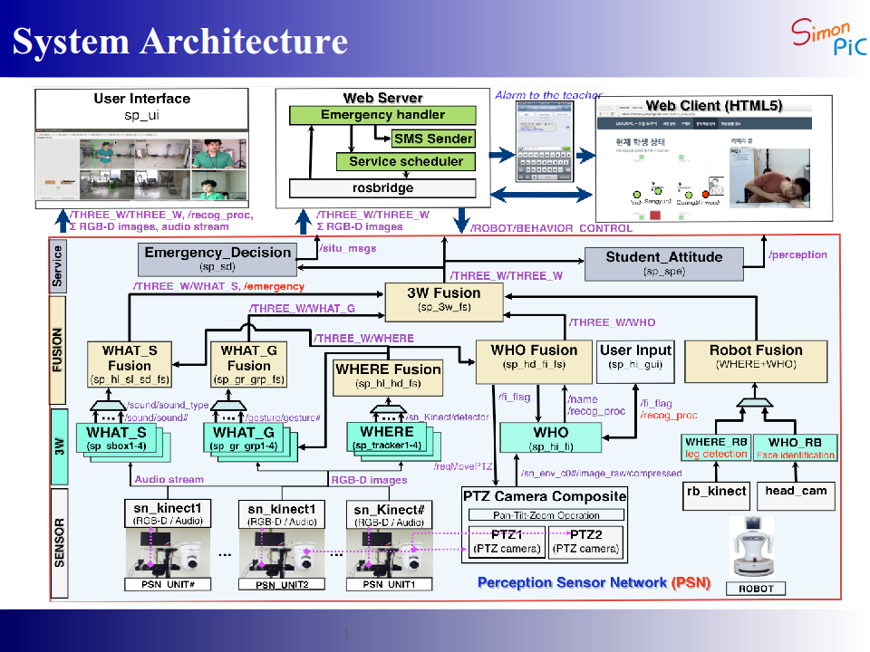

## What is the SimonPic?

SimonPic Project는 복수의 사람에(Multi-users) 대한 다양한 인식(Who, Where, What) 정보를 다중 센서(Multi-sensor)를 기반으로 인식 및 융합하는 기술을 개발하는 프로젝트이다.
 
  
SimonPic project is for the purpose of the implementation of technologies for identification (WHO), behavior (WHAT) and location (WHERE) of human based sensor network fusion program. 
In this project we develop a robot-assisted management system for promptly coping with abnormal events in classroom environments.

* Simon PIC : Sensor network-based In Motion [Perception]  In-Cloud

## System Structure

Kinect 와 PTZ(Pen, Tilt, Zoom) 카메라로 구성된 센서 네트워크 유닛(PSN_UNIT) 들과 인식된 정보를 융합하여 로봇 구동 및 실시간 알림 어플리케이션 기능이 포함된 시스템 구조도

아래는 각 모듈별 참여 연구 기관
* [What_S] 음성/음원 위치 추정 및 인식(Sound Localization & Classifcation) - [Korea Institute of Science & Technology](http://kist.re.kr)
* [Where] 사람 검출(Detection) 및 위치(Where) 인식 - [Korea Institute of Science & Technology](http://kist.re.kr)
* [What_G] 사람 행동(Gesture) 인식 - [Korea University](http://www.korea.ac.kr)
* [WHO] 사람 얼굴 및 신원 인식(Who) - [Postech](http://www.postech.ac.kr)

### Reference Repository(Private)
If you are interested in these sources, Please send mail to the following address.
- Perseption Sensor Network Unit, [Github-Repository](https://github.com/gyeorelee/psn_unit.git)
- Information Fusion & Integration System, [Github-Repository](https://github.com/gyeorelee/simonpic_recognition.git)

### Contact
[Gyeore Lee](https://shri-lab-kist.github.io/people/gyeorelee) : [e-mail](lkrrufp@kist.re.kr)
 

---
### Remote Handling for Emergency based on 3W (WHO/WHAT/WHERE) Information
<html>
<head></head>
<body>
<iframe width="640" height="360" src="https://www.youtube.com/watch?v=pt8mgxO08c0" frameborder="0" allow="autoplay; encrypted-media" allowfullscreen></iframe>
</body>
</html>
 

### Final 3W (WHERE-WHO-WHAT) Integration
<html>
<head></head>
<body>
<iframe width="640" height="360" src="https://www.youtube.com/watch?v=3sjWdq6P_hY" frameborder="0" allow="autoplay; encrypted-media" allowfullscreen></iframe>
</body>
</html>
 

### Audio-Visual Integration (WHAT: gssl+ssc)
<html>
<head></head>
<body>
<iframe width="640" height="360" src="https://www.youtube.com/watch?v=pHfZKAX6FWU" frameborder="0" allow="autoplay; encrypted-media" allowfullscreen></iframe>
</body>
</html>

### HRI2015 Leg detection
<html>
<head></head>
<body>
<iframe width="640" height="360" src="https://www.youtube.com/watch?v=tVGpAoH13dI" frameborder="0" allow="autoplay; encrypted-media" allowfullscreen></iframe>
</body>
</html>

