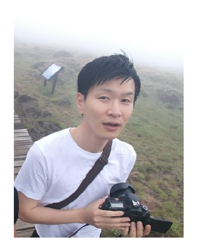

{: width="300" height="400"}

**PhD Students** Hanyang University Department of Computer Science Center for Robotics Research Convergence Research Center for Diagnosis, Treatment and Care System of Dementia Korea Institute of Science and Technology(KIST) 

### Contact

Email : feelgood88@kist.re.kr 
Office : L8421, International Cooperation Building, KIST(Korea Institute of Science and Technology)  
Phone : +82-2-958-6815

### Research Interests

- Ontology for Elderly with Dementia
- Computer vision
- HRI(Human-Robot Interaction)

### Research Interests

- **Knowledge based Context Reasoning**
  - *Ontology based context reasoning*
  - *Context aware and decision making*

- **Computer Vision**
  - *Moving Object Detection algorithm*
  - *Object Perception algorithm*  

### Career

- M.S. in Electronics and Computer Engineering and Robot Engineering  at Hanyang University (2016)

### Publications

- **International Conference paper**
  1. H Jeon, KM Yang, S Park, J Choi, Y Lim,(2018) [An Ontology-based Home Care Service Robot for Persons with Dementia](https://ieeexplore.ieee.org/abstract/document/8525668),  27th IEEE International Symposium on Robot and Human Interactive Communication (RO-MAN), 2018, pp. 540-545.
  2. H Jeon, S Park, J Choi, Y Lim (2018) [Ontology-based Dementia Care Support System](https://ieeexplore.ieee.org/abstract/document/8512965), 40th Annual International Conference of the IEEE Engineering in Medicine and Biology Society (EMBC), 2018, pp.3318-3321.

- **Domestic Journal paper**
 1. H.W. Jeon, S.W. Nam,(2016) [Improved gradient based MKFC algorithm for moving object detection](http://www.riss.kr/search/detail/DetailView.do?p_mat_type=1a0202e37d52c72d&control_no=e225c4f6e961b9817ecd42904f0c5d65), Korea Dance and Technology, 2016, pp. 171-190.
 2. H.W. Jeon, S.W. Nam (2015) [Detection of moving objects using gradient-vector based MKFC under indoor light illumination conditions](http://www.riss.kr/search/detail/DetailView.do?p_mat_type=1a0202e37d52c72d&control_no=d26851aa345fd6a8d18150b21a227875), Korea Dance and Technology, 2015, pp. 9-25.
